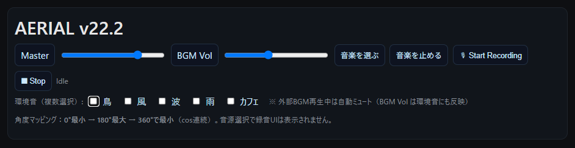

# AERIAL v22.2 — Hum Theremin Recorder

スマホやタブレットを**傾けるだけ**で音が変わる、かんたんテルミン。  
外部BGMや環境音（鳥/風/波/雨/カフェ）と**一緒に鳴らして**、そのまま**録音**できます。

---

## デモ（GitHub Pages）

https://masato-nasu.github.io/AERIAL/

---

## できること（ざっくり）

- **傾けて演奏**：0°で小さく、180°で大きく（360°でまた小さく）  
  → 途切れない**なだらかなカーブ**で音が変わります。
- **音量**：  
  - **Master** … 全体の音量  
  - **BGM Vol** … BGMの音量＋**環境音の音量もこれに連動**
- **外部BGM**：手元の音楽ファイルを再生  
  → **音楽を止める**で停止
- **環境音**：鳥 / 風 / 波 / 雨 / カフェ を**複数同時にON**  
  → **BGM再生中は自動でミュート**（BGMが主役のときに環境音が邪魔しません）
- **録音**：🎙 Start → ⏹ Stop でファイル保存

---

## 使い方（はじめての方向け）

1. ページを開いたら、最初に **「Start」** をタップ  
   （スマホの“自動再生制限”を解除して、音が出るようにします）
2. 端末をゆっくり傾けると、**音の高さと大きさが変化**します  
   - 画面が**下向き**：一番小さい  
   - 画面が**上向き**：一番大きい
3. 外部音楽を足したいときは **「音楽を選ぶ」**  
   → 再生中は **「音楽を止める」** で停止
4. **環境音**はチェックでON/OFF（複数OK）  
   → BGMが鳴っている間は**自動でミュート**
5. **録音**したいときは  
   - 🎙 **Start Recording** → 演奏 → ⏹ **Stop**  
   - 録音ファイルが**自動ダウンロード**されます

---

## よくある質問（Q&A）

- **音が出ません**  
  → まず**Start**をタップ。スマホの**消音スイッチ**や**音量**も確認。  
- **カフェの音が聞こえません**  
  → **BGMを止めて**からカフェにチェック。BGM再生中は環境音が自動ミュートされます。  
  → 小さければ **BGM Vol を上げる**（環境音も一緒に上がります）
---
